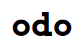

  <a href="https://odo.surge.sh">
    

      
    

  </a>

## What is odo?

odo is a minimalist todo list app built with [Svelte](https://svelte.dev).

## How to use it?

- `Enter` -- Create a new todo
- `Tab` / `Shift + Tab` -- Navigate between todos
- `Delete` on Mac / `Backspace` on Windows -- Delete todo (content)

## Known Bugs

🎉 All fixed!

## Todo

- [ ] Dark mode
- [ ] Change layout
- [ ] Repeated todo
- [ ] Date & time setting
- [ ] Background & theme customization
- [ ] Note taking
- [ ] Note tags
- [ ] Log view / Calendar view
- [ ] User login
