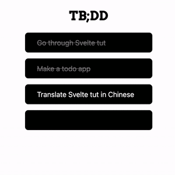

## What is TB;DD?

> TB;DD stands for "Too busy; Didn't do".

TB;DD is a minimalist todo list app built with [Svelte](https://svelte.dev). More features to come.

## How to use it?
- `enter` -- Create a new todo
- `tab` / `shift` + `tab`-- Navigate between todos
- `delete` on mac / `backspace` on win -- Delete todo (content)

## Showcase

## Known Bugs
- Deleting text doesn't persist after refreshing. 🔨

## Upcoming Features
- User login
- Todo repetition
- Date & time setting
- Background & theme customization
- Dark mode